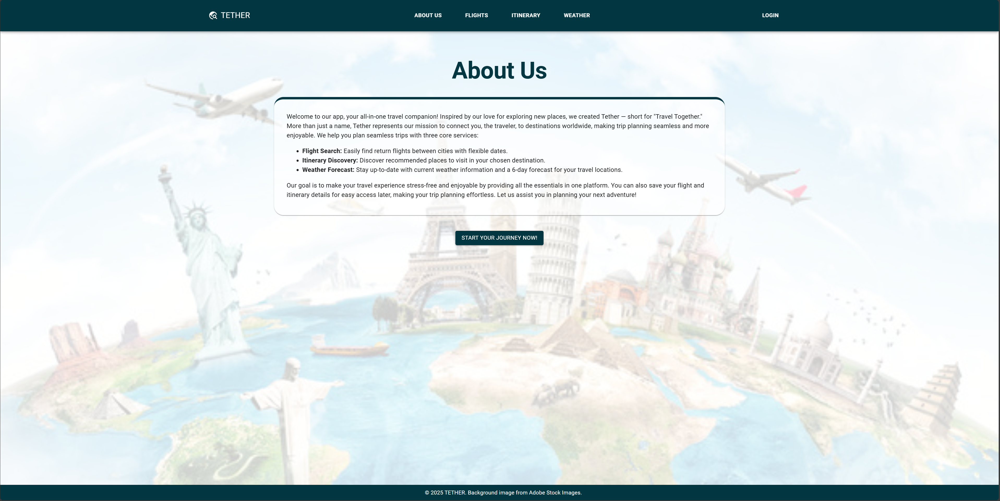
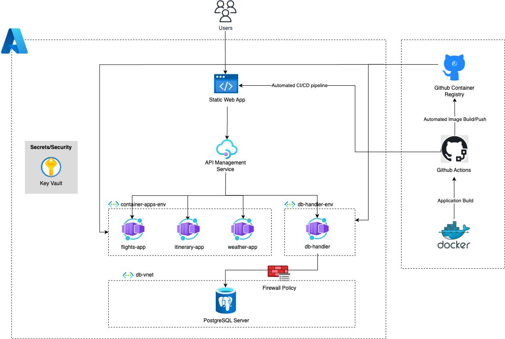

# tether

Tether (short for “Travel Together”) is our software solution to travel planning needs, comprising three core services: flight search, itinerary planning, and weather forecast.

This app was deployed using Azure services (no longer running) (see architecture diagram below for more details). Users would have to login using their GitHub account before using any of the services.

To learn more about individual microservices & frontend, please navigate to their respective README page.

## A glimpse of our webpage

Video link: https://youtu.be/hpTvxUha0e4

## Architecture diagram

