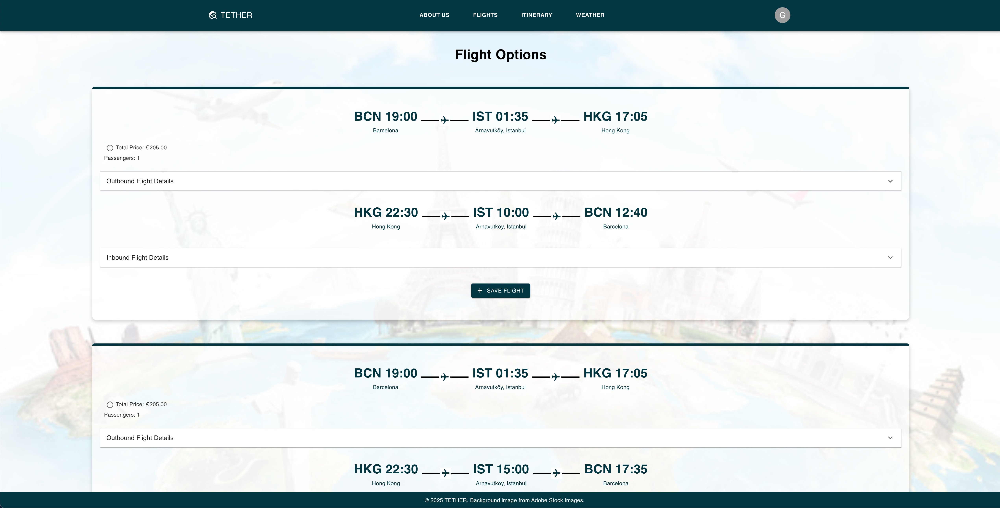

# Flight Microservice

This microservice uses the Amadeus Flight Offers API to find the cheapest flight for a given itinerary (between 2 cities, with departure & return dates & number of passengers).

## Website images





## Endpoints
The API specification can be found here:
[Flight OpenAPI JSON Specification](./docs/openapi.json)

## Local Usage and Development
First create an environment (conda or venv):

```
conda create -n flight python=3.10 -y
conda activate flight
pip install -r requirements.txt
```


### Running locally on Uvicorn

From the `flight-app` directory, you can run the app using uvicorn:

```
uvicorn app:app --reload
```


### Running on Docker
Alternatively, you can run by pulling an existing public Docker image:

```
docker pull ghcr.io/zjx047/flight-app:latest
docker run -d -p 9000:9000 -e AMAD_CLIENT_ID="insert_key" -e AMAD_CLIENT_SECRET="insert_secret" ghcr.io/zjx047/flight-app:latest
```

Here is a sample request when docker is running:

```
curl -X 'POST' \
  'http://127.0.0.1:9000/flight' \
  -H 'Content-Type: application/json' \
  -d '{
    "user_id": "5",
    "flights": {
        "origin_loc_code": "JFK",
        "destination_loc_code": "LHR",
        "departure_date": "2025-02-26",
        "return_date": "2025-02-28",
        "num_passenger": "1"
    }
  }'
```