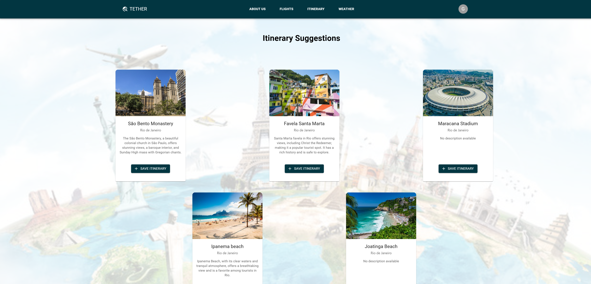

# Itinerary Microservice

This microservice uses two APIs:
1. OpenWeather: gets the longitude and latitude of a city from the name
2. Amadeus Tours and Activities: gets a list of activities around a given latitude and longitude

## Website images





## Endpoints
The API specification can be found here:
[Itinerary OpenAPI JSON Specification](./docs/openapi.json)

## Local Usage and Development
First create an environment (conda or venv):

```
conda create -n itinerary python=3.10 -y
conda activate itinerary
pip install -r requirements.txt
```


### Running locally on Uvicorn

From the `itinerary-app` directory, you can run the app using uvicorn:

```
uvicorn app:app --reload
```


### Running on Docker
Alternatively, you can run by pulling an existing public Docker image:

'''
docker pull ghcr.io/gphang/itinerary-app:latest
docker run -d -p 7000:7000 -e OPENWEATHER_KEY="insert_key" -e AMADEUS_KEY="insert_key" -e AMADEUS_SECRET="insert_secret" ghcr.io/gphang/itinerary-app:latest
'''

Here is a sample request when docker is running:
curl -X 'POST' \
  'http://127.0.0.1:7000/itinerary' \
  -H 'Content-Type: application/json' \
  -d '{
    "user_id": "5",
    "itinerary": {
      "city": "London",
      "radius": 10,
      "limit": 5
    }
  }'